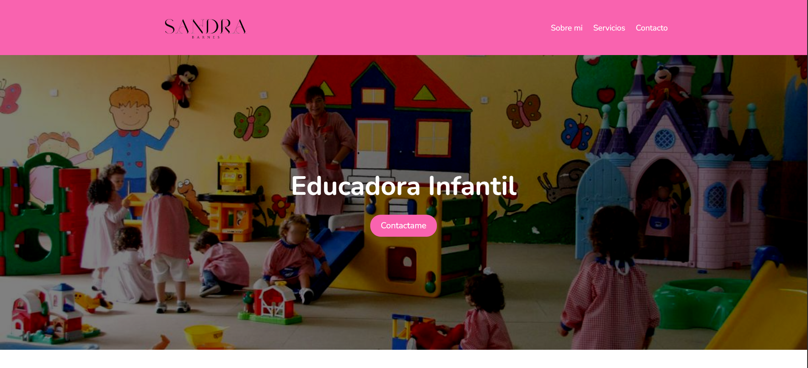

# Educadora Infantil - Sitio Web Profesional 🎨👧📚



Sitio web profesional para una educadora infantil que ofrece servicios de cuidado temprano, estimulación cognitiva y orientación familiar.

## 📝 Descripción

Portal web que incluye:
- Presentación profesional
- Catálogo de servicios
- Formulario de contacto
- Información de ubicación
- Redes sociales
- Recursos educativos

**Objetivo principal**: Proporcionar una plataforma digital moderna para conectar con familias y mostrar metodologías educativas.

## ✨ Características principales

### 🎯 Secciones clave
- **Header interactivo** con menú responsive
- **Hero section** con efecto de superposición
- **Tarjetas de servicios** con hover animations
- **Formulario de contacto** con validación
- **Footer** con 3 columnas responsivas
- **Integración con redes sociales**

### 🌈 Aspectos técnicos destacados
- ✅ Semántica HTML5
- ✅ Flexbox + CSS Grid
- ✅ Transiciones CSS suaves
- ✅ Iconos vectoriales
- ✅ Performance optimizada

## 🛠 Tecnologías utilizadas

**Frontend:**
- 
- 
- 

**Herramientas:**
- 
- 
- 

## 🚀 Instalación

1. Clona el repositorio:
```bash
git clone https://github.com/alexgargonzalez/proyectoHTMLCSS.git
